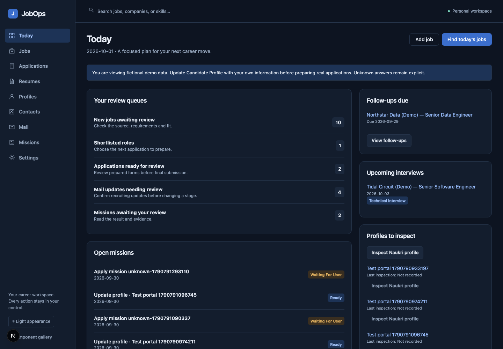
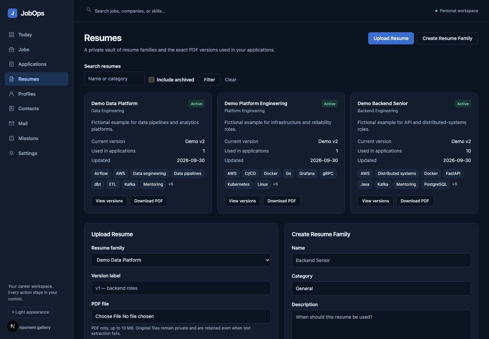
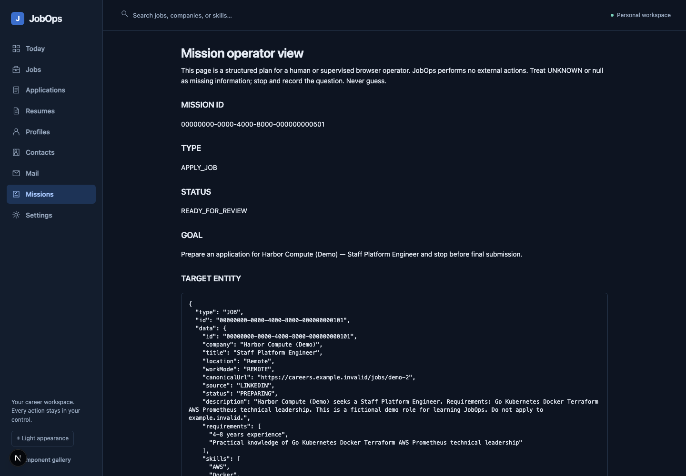

# JobOps

A personal career workbench for job discovery, applications, resume versions, portal profiles, contacts, recruiting mail, and supervised missions.

JobOps decides and remembers **what** needs doing. A human or external computer-use operator decides **how** to do it. There is no OpenAI/Anthropic/Gemini API integration, LLM runtime, portal automation, email sending, or automatic application submission. `HUMAN`, `CHATGPT`, `CLAUDE`, `CODEX`, and `OTHER` are execution metadata only.

## Local setup

Requires Node.js 22.16+ (tested with 24), npm, and Docker Desktop. From the repository root:

```bash
cd jobops
cp .env.example .env
docker compose up -d
npm install
npm run db:migrate
npm run dev
```

Open [JobOps](http://127.0.0.1:3210). PostgreSQL binds to `127.0.0.1:5549`; the application binds to `127.0.0.1:3210`. These ports avoid the other local projects. A new workspace starts empty, ready for your own candidate information, resume and saved jobs. Starting the application or applying migrations never inserts sample data.

Use the exact origin configured in `APP_URL` when opening the application. If you change the application port or host, update both the launch command and `APP_URL`; update the Gmail callback too when Gmail is configured. Mutating requests from a different origin are rejected.

Fictional data is reserved for controlled demonstrations and the isolated browser-test database. `npm run db:seed` is an explicit opt-in command; do not run it as part of normal setup. Its candidate facts, companies, contacts, PDFs and messages are fictional. It preserves existing records and candidate configuration, but deliberately inserts missing examples. Unknown application answers remain `UNKNOWN` until you provide them.

## What is implemented

- **Home:** six editable starters (find openings, tailor a resume, improve profiles, prepare an application, draft outreach, showcase work), a custom goal, human review and high-priority mail. Focus is India; preferences are yours to edit.
- **My profile:** working preferences, LinkedIn, GitHub, portfolio websites and job portals, improvement notes, original PDFs, approved versions and confirmed candidate details together.
- **Tasks and agent API:** copy a handoff into your existing ChatGPT/Claude/Codex conversation; use its existing context without assuming a role. Task-scoped expiring bearer access supports progress, immutable proposals, draft PDFs and operator evidence. Only browser decisions approve work; retries reuse records and revised external work requires fresh approval.
- **Opportunities and Inbox:** a compact opportunity list with tailoring/application/referral actions; on-demand Gmail refresh, India date filters, Today/This week/Older mail groups, action reasons and reversible done/reopen controls. Original messages remain available.
- **Jobs:** manual creation; search and URL-persisted company, role, location, source, status, freshness and experience filters; newest/added/keyword sorting; details, notes, snapshot history, contacts and missions.
- **Import:** JSON/CSV row validation, preview, normalized URLs, URL/fallback duplicate detection including same-batch duplicates, explicit skip/merge, atomic writes, preserved snapshots and summary.
- **Resumes:** logical families, validated PDF uploads, original bytes, SHA256, local text extraction, grouped keywords, editable keywords/skills/experience tags, preview/download, version history, current selection and archiving. Extraction failure keeps the PDF and supports retry/manual keywords.
- **Applications:** list/board, selected version, stage movement, next action date, notes, append-only timeline, related mail/missions/contacts. Recording final submission requires explicit confirmation.
- **Missions:** twelve types, editable instructions/constraints/steps, discovery preferences, application preparation, profile diffs, executions/operators, human and plain agent views, copyable agent links, context JSON, results, screenshots/files and audit history. Unknown questions block ready/submitted application results. Terminal missions retain their results.
- **Profiles:** portal records, known/target JSON, explicit field differences, inspect/update missions, observed-state recording with approval and stale-state checks.
- **Contacts:** company/search filters, public sources, email/LinkedIn, manual verification and mission results.
- **Mail:** imported recruiting messages, deterministic classification and explainable confidence, proposed links, review queue and reviewed timeline events. Application stage changes require explicit review. Optional Gmail OAuth and incremental paginated read-only sync.
- **Settings:** canonical candidate facts, named standard answers, job preferences, mission defaults, storage information, mail configuration, basic display preferences and exports.
- **Export:** jobs/applications/contacts CSV or JSON, missions JSON including steps/executions/evidence metadata, candidate JSON. CSV formula escaping is enabled. Exports do not include OAuth tokens or file contents.
- **Interface:** responsive dark/light workbench, accessible labeled forms, keyboard focus, real links and buttons, and a retained interactive [component gallery](http://127.0.0.1:3210/gallery).

## Working with an assistant

Start in **My profile** with your real resume, public links and preferences. On **Home**, choose and edit a task, then copy its handoff into the assistant session you already use. JobOps neither reads assistant memory automatically nor starts an LLM. The assistant returns work for your review; only an approval on its exact latest proposal permits an application, message or publication. Uploading a proposed PDF keeps the current resume until you approve the revision.

Set `JOBOPS_ACCESS_TOKEN` in your private `.env`, restart, and unlock your browser before generating agent API access on a task. Never share the workspace key with an agent: share only that task's generated credential. The [agent guide](http://127.0.0.1:3210/agent-guide) describes payloads, and the scoped context response includes the machine-readable contract. Credentials expire after seven days and can be replaced or revoked. Cloud assistants need access to the app's origin; if localhost is unreachable, paste the result through the task page instead.

Home and task pages refresh saved task state every 15 seconds while visible. Optional browser notifications announce changed review items on these pages; this is not background push delivery when JobOps is closed. Gmail refresh happens only on demand and requires a real configured read-only connection. Marking an email done does not change an application stage.

## Architecture

One Next.js 16.3.8 App Router repository with React 19.3, strict TypeScript, Tailwind 4, owned shadcn-style primitives, Zod, Drizzle and PostgreSQL. Server-rendered pages read relational data; validated server actions call domain modules and commit transactional updates. No queue, worker, Redis, microservice or external AI dependency is required.

```text
src/app/                 Pages, protected JSON/download/OAuth routes
src/components/          Workbench shell, accessible forms and owned UI primitives
src/features/            Tasks, candidate, jobs, applications, resumes, missions, profiles, contacts, mail
src/db/                  Typed relational schema and lazy PostgreSQL pool
src/services/            Private local storage, PDF extraction, keyword dictionary, mail rules/OAuth
drizzle/                 Versioned SQL migrations and schema snapshots
scripts/                 Migrations, fictional seed, isolated browser-test runner
tests/                   Unit and real-browser integration tests
data/uploads/            Private originals and mission evidence (ignored by Git)
```

Twenty-three separate tables model the requested domains, including scoped credentials, immutable task proposals, human decisions and progress updates. Applications use one canonical stage enum. Job descriptions are snapshots, resume versions retain files, and significant changes append application/activity events. Mission results record previous/new state and evidence in the same transaction as entity updates. Resume selection changes invalidate saved heuristic comparisons. Indexes, foreign keys, unique current-version constraints and numeric/range checks live in migrations.

Keyword coverage is dictionary-based overlap: matched job keywords divided by all job keywords. Aliases and token boundaries are normalized; matched/missing/resume-only keywords are visible. It does not measure proficiency or predict hiring outcomes. Keywords are editable.

## Commands

| Command                                   | Purpose                                                        |
| ----------------------------------------- | -------------------------------------------------------------- |
| `npm run dev`                             | Local workbench on port 3210                                   |
| `npm run build` / `npm start`             | Production build / loopback production server                  |
| `npm run lint`                            | ESLint                                                         |
| `npm run typecheck`                       | Strict TypeScript                                              |
| `npm run test`                            | Vitest domain/security/storage/PDF tests                       |
| `npm run test:e2e`                        | Real Chromium workflows in an isolated database/server/storage |
| `npm run format` / `npm run format:check` | Prettier                                                       |
| `npm run db:generate`                     | Generate SQL after a schema change                             |
| `npm run db:migrate`                      | Apply committed migrations                                     |
| `npm run db:seed`                         | Explicit fictional data for controlled demos/tests only        |
| `npm run db:studio`                       | Local Drizzle Studio; keep it private                          |

Install the browser once with `npx playwright install chromium`. `test:e2e` derives a separate `jobops_e2e` database using the local PostgreSQL credentials, uses `data/e2e-uploads`, `.next-e2e`, and port 3211, and checks an ownership marker before using an existing test database. It never drops or resets your normal database. The database role needs `CREATEDB` (the Docker development role has it). Test data remains in the isolated database for inspection; application data is not cleaned or reset.

The protected API checks run separately from browser-only mode:

```bash
JOBOPS_E2E_ACCESS_TOKEN=jobops-test-only-workspace-access-key-2026 npm run test:e2e -- tests/e2e/task-api.spec.ts
```

This is a test-only key for the isolated test server. Confirmed results and remaining integration setup are recorded in [verification.md](docs/verification.md).

## Environment

| Variable                                   | Required / behavior                                                                               |
| ------------------------------------------ | ------------------------------------------------------------------------------------------------- |
| `DATABASE_URL`                             | PostgreSQL connection; example targets the local Compose service                                  |
| `APP_URL`                                  | Canonical origin; defaults to `http://127.0.0.1:3210`                                             |
| `JOBOPS_ACCESS_TOKEN`                      | 32+ characters required for agent API or a network domain; browser-only loopback works without it |
| `STORAGE_ROOT`                             | Default `./data/uploads`; persistent private local directory                                      |
| `GOOGLE_CLIENT_ID`, `GOOGLE_CLIENT_SECRET` | Optional Gmail web OAuth client                                                                   |
| `GOOGLE_REDIRECT_URI`                      | Same-origin `/api/gmail/callback`; example in `.env.example`                                      |
| `GMAIL_TOKEN_ENCRYPTION_KEY`               | Optional Gmail prerequisite: base64-encoded 32 random bytes                                       |

Use `.env`; do not commit it. Generate independent access/encryption secrets locally:

```bash
node -e 'console.log(require("node:crypto").randomBytes(32).toString("hex"))'
node -e 'console.log(require("node:crypto").randomBytes(32).toString("base64"))'
```

The first output can be `JOBOPS_ACCESS_TOKEN`; the second is `GMAIL_TOKEN_ENCRYPTION_KEY`. Keep the encryption key with your secure backups: changing it makes stored Gmail tokens unreadable.

## Gmail read-only setup

Mail import works with all Google variables empty. To connect a real account:

1. Create a Google Cloud project, enable the Gmail API, configure OAuth consent, and add your account as a test user if the app is in testing mode.
2. Create an OAuth **web application** client. Register exactly `http://127.0.0.1:3210/api/gmail/callback` locally (use your HTTPS domain in production).
3. Set client ID/secret, redirect URI and the base64 encryption key in `.env`, then restart Next.js.
4. Open Settings → Mail Integration → Connect Gmail. Consent requests **only** `https://www.googleapis.com/auth/gmail.readonly`; state and PKCE protect the callback. Tokens are AES-256-GCM encrypted in PostgreSQL.
5. Choose **Sync recruiting mail**. Sync is manual, inbound only, bounded to batches of 100, and continues with a cursor. The initial window is 30 days; later sync overlaps the last completed window for deduplication. Deterministic relevance/classification rules retain recruiting messages for review.
6. Open Mail review, confirm the classification/link, and append an event. Application stages change only through explicit reviewed controls.

Live OAuth and mailbox sync require your credentials and were not exercised against a real account. Configuration, encryption, broad-scope rejection, import and reviewed-event behavior are tested. Google classifies `gmail.readonly` as a restricted scope; review its verification requirements before publishing the integration. Testing-mode tokens may expire. Follow [Google's Gmail scopes documentation](https://developers.google.com/workspace/gmail/api/auth/scopes) and [web-server OAuth guidance](https://developers.google.com/identity/protocols/oauth2/web-server).

## Resume storage and backup

Original PDFs are limited to 10 MiB, validated by type/extension/signature, stored using opaque UUID filenames with private permissions, and served through protected routes. Names supplied by users never determine filesystem paths. Path traversal and symlinks are rejected. Parsing uses local `pdf-parse`, without OCR or network calls. Scanned/encrypted/corrupt PDFs can require manual keywords; originals remain available.

Back up the database and storage together. A JSON/CSV export is useful for portability but does not contain original resume/evidence bytes, OAuth connections or every settings record.

```bash
mkdir -p backups
docker compose exec -T postgres pg_dump -U jobops -d jobops -Fc > backups/jobops.dump
tar -czf backups/jobops-uploads.tar.gz data/uploads
```

Run these commands from `jobops/`. The dump command targets the default Compose database; the archive command targets the default `STORAGE_ROOT`. If either location is customized, back up the configured database and actual storage directory instead. The Compose service must be running for `pg_dump`.

Store backups outside Git and securely preserve your `.env` secrets separately. Keep the original `GMAIL_TOKEN_ENCRYPTION_KEY` to restore Gmail connections. Test restoration into a **separate** database/storage root before relying on backups; do not restore over live data without an explicit decision.

The original development fixtures were removed from the main local workspace after being backed up. The one-time `scripts/clean-demo.ts` utility recognizes only the initial development session, preserves later edits, checks references from retained records, and requires an exact preview digest before applying a transactional deletion. It saves private record/upload backups under ignored `data/backups/`. It does not reset the schema, run at startup, or touch `jobops_e2e`. It is not a general-purpose delete or reset command.

## Mission operation

Every mission has a human page `/missions/[id]`, a predictable agent page `/missions/[id]/agent`, a protected `/missions/[id]/context.json`, and a simple `/missions/[id]/result` form. Selected resumes have direct download links. Contexts omit unrelated private fields, compensation, credential storage and filesystem paths; discovery does not expose candidate identity.

An operator follows the mission's constraints on external sites and returns result/evidence to JobOps. Default apply missions stop before Submit, prohibit fabricated facts and resume modification, and require recording unknown questions. Profile update missions list exactly approved differences. JobOps cannot enforce behavior on an external portal; a human must supervise the operator and final submission.

See [agent-usage.md](docs/agent-usage.md) for manual, ChatGPT Work/Computer Use, Codex computer use and Claude Cowork workflows.

## Production and security

V1 is a single-user local tool. Its default loopback binding and Host checks reduce accidental exposure; mutations require the configured origin. Setting a 32+ character access token protects pages, server actions, files, exports and context JSON with an HttpOnly cookie. The cookie is Lax to permit Google OAuth return navigation, Secure on HTTPS, and expires after twelve hours. Rotating the token invalidates existing sessions. Gmail state/PKCE cookies are separate.

For deployment, set the exact HTTPS `APP_URL`, a strong access token, production database credentials and Gmail callback, and place Next.js behind an HTTPS reverse proxy. Keep the application loopback-bound behind that proxy, preserve the canonical Host/Origin, restrict database/file access, use persistent storage, encrypted backups, and process supervision. A public service should replace the shared-token mechanism with mature authentication/authorization and rate limiting. No portal passwords, Google passwords, cookies from external websites or AI credentials are requested or stored.

The local Compose password is development-only. Use a managed/private database or your own restricted PostgreSQL credentials for deployment. Filesystem storage assumes one persistent application instance; use the storage service boundary for R2/S3 before horizontal scaling. Do not publish Drizzle Studio, test servers, Compose PostgreSQL, uploads or backups.

## Limitations and next improvements

- Single user; no collaboration or granular roles. Shared-token protection is intended for a personal/private deployment.
- No job-site scraping, autonomous browsing/submission, external email sending, LLM features, or paid verification APIs.
- Dictionary coverage misses unusual technologies and cannot assess experience. OCR is absent.
- Gmail rules can misclassify; every proposal stays reviewable. Sync is on demand, not a background subscription.
- Exports are portable records, not a full restore mechanism. Back up PostgreSQL plus originals separately.
- Application boards use explicit links/stage controls; drag-and-drop is not required. There is no calendar-provider sync.
- Suggested next work: production authentication, backup/restore tooling, private object storage adapter, a richer job import conflict resolver, configurable keyword dictionaries and broader Gmail rule fixtures.

## Screenshots

The screenshots below show fictional local data captured during browser verification.




